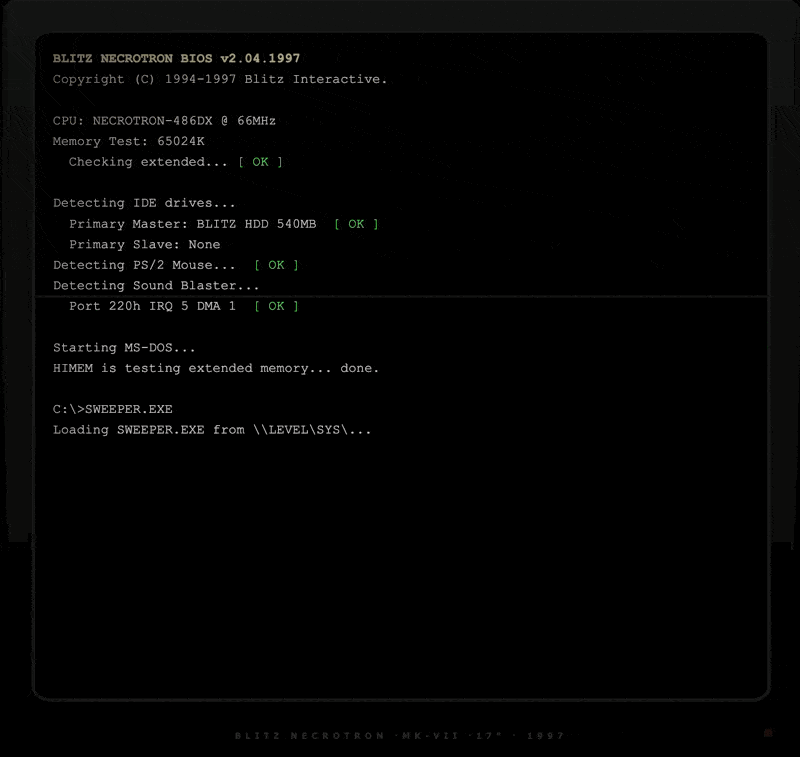

# SWEEPER.EXE

Minesweeper disguised as cursed shareware from 1997. Arcade pressure, escalating depths, CRT monitor, VHS artifacts, Windows 98 desktop. The trial expired 25 years ago. It still runs.



## Quick Start

Open `index.html` in any browser. No install, no server, no dependencies.

Or host anywhere that serves static files (GitHub Pages, Netlify, etc).

## What It Does

You found an old hard drive. There's one program on it. Double-click SWEEPER.EXE.


The system boots through a BIOS POST sequence, loads into a full Windows 98 desktop with draggable icons, a working taskbar, and a VHS timestamp frozen in January 1998. Session counter says 00047 of 00003 allowed. Something already happened here.


### The Game

Descend through 5 depths. Grids grow, mines multiply, time shrinks. Hit a mine or run out of time and you restart from Depth 1.

| Depth | Grid | Mines | Time |
|-------|------|-------|------|
| 1 | 8x8 | 10 | 2:30 |
| 2 | 10x10 | 15 | 2:20 |
| 3 | 12x12 | 25 | 2:10 |
| 4 | 14x14 | 35 | 2:00 |
| 5 | 16x16 | 50 | 1:50 |

Half of your remaining time carries into the next depth.

### Classes

Choose a class before each run. Each changes how the game plays:

- **Sweeper** -- default, no modifiers
- **Wraith** -- mines shift after each reveal, but you move faster
- **Eden** -- unlockable, tiles heal themselves
- **Manna** -- unlockable, divine RNG manipulation

### Relics and Curses

Earn keys (shards) by revealing tiles and clearing depths. Spend them between depths on relics:

- **BACKUP** -- reclaims 20 seconds
- **FIREWALL** -- absorbs your next mine hit
- **SCANDISK** -- auto-marks 3 hidden mines
- **DEFRAG** -- reveals a 2x2 region, marks mines
- **TRACERT** -- reveals empty tiles touching a correct flag

Cursed relics cost less but come with a price:

- **SPYWARE** -- reveals 5 tiles as dead (no number info)
- **ADWARE** -- +30 seconds, but key gain halved for 60s
- **BLOATWARE** -- absorbs a hit, but halves your remaining time

### The Desktop

The entire game lives inside a simulated Windows 98 environment:

- **SWEEPER.EXE** -- the game
- **LORE.HLP** -- help file with lore entries
- **My Computer** -- file browser with system files and secrets
- **Recycle Bin** -- deleted files that shouldn't be readable
- **COMMAND** -- working terminal (try `help`)
- **AUTHOR.TXT** -- credits
- **Start Menu** -- restart the system
- **Taskbar** -- running apps, sound toggle, clock

Windows are draggable and stackable. Desktop icons are draggable. The system boots, restarts, and plays authentic Windows XP startup/shutdown sounds.

### Controls

- **Left-click** -- reveal a tile
- **Right-click** (or long-press on mobile) -- place a flag
- **Relic badges** -- click during gameplay to activate

## Tech Stack

| Layer | Tools |
|-------|-------|
| Game | Single-file HTML/CSS/JS |
| Fonts | Tahoma, JetBrains Mono, VT323, Space Grotesk |
| Audio | Web Audio API (procedural) + MP3 for boot/shutdown |
| Save | localStorage |
| Visual | CRT scanlines, VHS overlays, chromatic aberration, film grain |

## Project Structure

```
index.html              # the entire game
assets/
  favicon.png
  audio/
    startup.mp3         # Windows XP startup sound
    shutdown.mp3        # Windows XP shutdown sound
  screenshots/
    boot.gif            # BIOS POST sequence
    desktop.gif         # Win98 desktop
    gameplay.gif        # desktop interaction
DESIGN.md               # full design system
cis1200/                # original Java Swing version (UPenn CIS 1200)
```

---

Built by Thomas Ou
